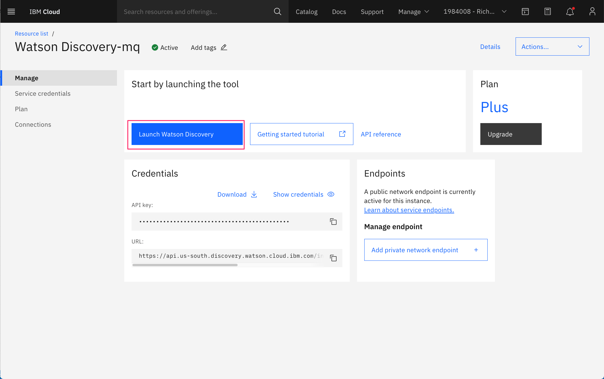
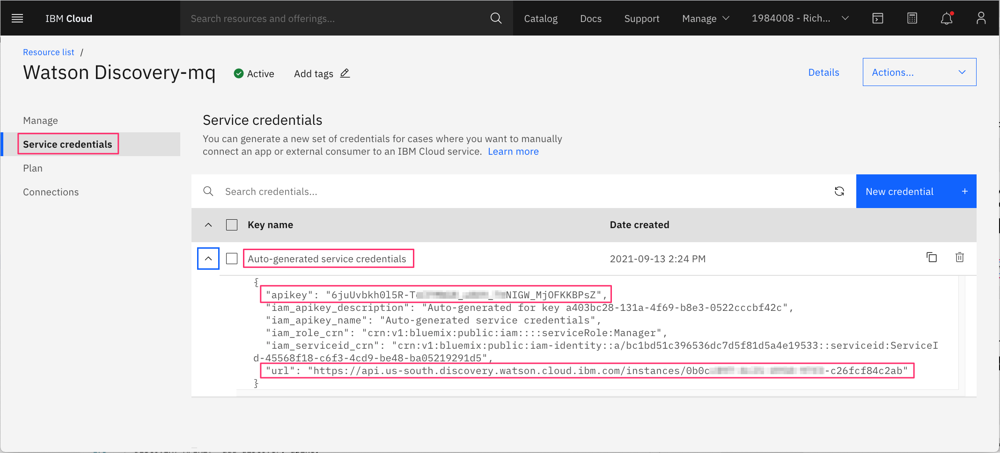
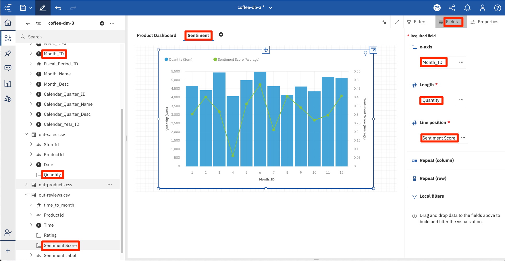
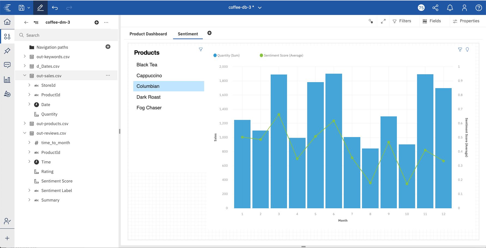

# Visualize unstructured data from Watson Discovery in the Cognos Analytics Dashboard

To leverage the voice of the customer to drive business results, companies need to leverage AI to gain actionable insights from sentiment, emotion, concepts and key words mentioned in customer feedback. Much of the important data a customer wants to share can already be found. It exists in public forums, blogs, social media posts, chat logs with customer representatives. The challenges to leveraging this information has historically been the unstructured nature of it. Today though, we have AI and services like Watson Discovery that can be trained to aggregate, enrich and help surface key customer insights. This code pattern shows how you can visualize unstructured data from Watson Discovery in Cognos Analytics for product performance analysis.

In this code pattern, unstructured data consisting of product reviews and customer surveys is imported into Cognos Analytics from Watson Discovery. The customer data also indicates the sentiment toward the products surveyed. This data can then be displayed on the Cognos Analytics dashboard. Combining Cognos Analytics with Discovery, clients will:

* Get early warning of trends based on customer feedback.
* Address escalating customer interactions with early intervention.
* Target the right customers with the right products and the right marketing.
* Know where to invest in your business to drive revenue and customer adoption.
* Get to the root cause of churning customers.
* Identify actions to increase your NPS or other customer satisfaction metric.

The theme of this code pattern is built around data for a small coffee manufacturer that sells their products in local markets. The data will consist of reviews and ratings for their different coffee flavors.


## Flow

1. Product Review data is loaded into Watson Discovery for enrichment. Results include sentiment analysis and keyword discovery.
2. User runs Cognos Analytics.
3. Data files are loaded directly into Cognos Analytics.

## Included components

* [Cognos Analytics](https://www.ibm.com/products/cognos-analytics): A business intelligence solution that empowers users with AI-infused self-service capabilities that accelerate data preparation, analysis, and report creation.
* [Watson Discovery](https://www.ibm.com/cloud/watson-discovery): A cognitive search and content analytics engine for applications to identify patterns, trends, and actionable insights.

**Important**: Before proceeding, ensure that you have access to the latest release of Cognos Analytics. Click [here](https://www.ibm.com/products/cognos-analytics) to get product and pricing information, as well as access to a free trial version.

## Featured technologies

* [Node.js](https://nodejs.org/): An open-source JavaScript run-time environment for executing server-side JavaScript code.

## Steps

1. [Clone the repo](#1-clone-the-repo)
1. [Create your Watson Discovery service](#2-create-your-watson-discovery-service)
1. [Configure Watson Discovery](#3-configure-watson-discovery)
1. [Add service credentials to environment file](#4-add-service-credentials-to-environment-file)
1. [Run scripts to generate data](#5-run-scripts-to-generate-data)
1. [Build a Data Module in Cognos Analytics](#6-build-a-data-module-in-cognos-analytics)
1. [Create a Cognos Analytics dashboard](#7-create-a-cognos-analytics-dashboard)
1. [Add visualizations to the dashboard](#8-add-visualizations-to-the-dashboard)
1. [Update Data Module](#9-update-data-module)
1. [Visualize the impact product reviews have on sales](#10-visualize-the-impact-product-reviews-have-on-sales)
1. [Next steps](#11-next-steps)

## 1. Clone the repo

```bash
git clone https://github.com/IBM/cognos-analytics-using-unstructured-data
```

## 2. Create your Watson Discovery service

To create your Watson Discovery service:

* From your IBM Cloud dashboard, click on `Create resource`.

* Search the catalog for `discovery`.

* Click the `Discovery` tile to launch the create panel.

  

  From the panel, enter a unique name, a region and resource group, and a plan type (select the default `Plus` plan). Click `Create` to create and enable your service.

  >**NOTE**: The first instance of Plus plan for IBM Watson Discovery comes with a free 30-day trial; it is chargeable once the trial is over. If you no longer require your Plus instance for Watson Discovery after going through this exercise, feel free to delete it.

## 3. Configure Watson Discovery

### Launch Discovery

From the IBM Cloud dashboard, click on your new Discovery service in the resource list.

  

From the `Manage` tab panel of your Discovery service, click the `Launch Watson Discovery` button.

### Create a project

The landing page for Watson Discovery is a panel showing your current projects.

  

Click `New project`.

  

Click the `Document Retrieval` type project, and then enter a unique project name.

Click `Next` to select the data source.

  

Select the `Upload data` option, and click `Next` to create and configure the collection.

### Create a collection

Next you will see the `Configure collection` tab panel.

  

Give the collection a unique name and click `Next`.

### Load the product review files

From the `Upload your data` panel, click `Drag and drop files here or upload` to bring up the selection list. From there, select all 998 json review files located in the `data/coffee_reviews` directory of your local repo.

  

Once all files start loading, click `Finish`.

>**NOTE**: You will see alerts displayed when the file loading is complete.

### Add keyword and sentiment enrichment

Once the files have started uploading, the `Improve and customize` panel will be displayed. Note that you can always navigate to this panel by clicking the top icon in the tool bar in the left margin.

  

In order to capture `keywords` from our data, click on `Keywords` from the `Extract meaning` drop-down menu.

  

From the `Enrichments` tab panel, select `text` as the field to enrich for all `Keywords`.

Do the same for the `Sentiment of Document` enrichment.

Once you have selected `text` as the field to enrich for both `Keywords` and `Sentiment of Documents`, click `Apply changes and reprocess` to apply the changes and reprocess the downloaded files.

Then click on the `Activity` panel to view the progress of the downloaded files in the collection.

  

## 4. Add service credentials to environment file

Next, you'll need to add the Watson Discovery credentials to the .env file.

* From the home directory of your cloned local repo, create a .env file by copying it from the sample version

  ```bash
  cp env.sample .env
  ```

* From your Discovery panel, click the `Integrate and deploy` icon in the left-side menu, then click on the `API Information` tab. Copy the Project ID value.

  

* Locate the service credentials listed on the home page of your Discovery service and copy the API Key and URL values.

  

* Edit the `.env` file with the necessary credentials and settings

  #### `env.sample:`

  ```bash
  # Copy this file to .env and replace the credentials with
  # your own before starting the app.

  # Watson Discovery
  DISCOVERY_PROJECT_ID=<add_discovery_project_id>
  DISCOVERY_APIKEY=<add_discovery_apikey>
  DISCOVERY_URL=<add_discovery_url>
  ```

## 5. Run scripts to generate data

The provided scripts can be used to generate sample data for a factitious company, Named "Acme Coffee". The company offers 5 types of coffee, which is sold in grocery stores.

The scripts build the following data, which will be output to local CSV files:

* Reviews: `data/out-reviews.csv` will contain all of the reviews for each of the products. Includes rating and sentiment score.
* Products: `data/out-products.csv` will contain information about each of our products. Includes product_id, name, and unit price.
* Keywords: `data/out-keywords.csv` will contain keywords generated from product reviews.

To run the script you will need to install [Node.js](https://nodejs.org/), an open-source JavaScript run-time environment for executing server-side JavaScript code.

```bash
npm install
cd lib
node generate-product-data.js
```

### Additional scripting information

Outside of the scripts used to build the product and data listed above, there are additonal scripts which were used to generate product review data. The end result of the scripts is the generation of 1000 food review json files that can be loaded into Watson Discovery (see [Step #3](#3-configure-watson-discovery)). Since we have included the 1000 json files in this repo, there is no need to run the scripts again, but it is worth discussing how they work.

#### lib/find-products-with-most-reviews.js

1. Download Amazon food review data from [Kaggle](https://www.kaggle.com/snap/amazon-fine-food-reviews).
1. Save as local file `data/Reviews-full.csv`.
1. Process all reviews and log the number of reviews per product, along with how useful each review is based on `helpfullness factor`.
1. Print out the list of products in order of useful reviews.

#### lib/generate-disco-input-files.js

1. Use the top 5 reviews determined by `find-products-with-most-reviews`.
1. Cut and paste the product ID of the products associated with these reviews.
1. Add a more user-readable product ID for each.
1. Process all reviews in `data/Reviews-full.csv`, and only process the top 200 useful reviews for the products we have identified.
1. Create a json file for each review and store it in the `data/coffee_reviews` directory.

> **Note**: The actual review dates were spread out from 2008-20017. In order to make the data more relevant to our needs, we modified all dates to be in 2019.

## 6. Build a Data Module in Cognos Analytics

In Cognos Analytics, a `Data Module` serves as a data repository. It can be used to import external data from files on premise, data sources and cloud data sources. Multiple data sources can be shaped, blended, cleansed and joined  together to create a custom, resusable and sharable data module for use in dashboards and reports.

### Upload files into Cognos Analytics

From the Cognos Analytics main dashboard, select the `+` icon in the lower left corner. Select `Upload files`.

From the file selection dialog, select the `csv` files created in the previous script:

* `data/out-products.csv`
* `data/out-reviews.csv`
* `data/out-keywords.csv`

### Create a new Data Module

From the main dashboard, select the `+` icon in the lower left corner. Select `Data module`.

From the source selection panel, select all 3 files and click `OK`.

  

The `Data module`panel will be displayed, with the 3 files listed in the left-hand resource list.

Select the `Relationships` tab from the content panel to view the files in the graphic editor. At this point, no relationships will exist.

  

To create a relationship, right click on the `out-products.csv` file to bring up the context menu. Select `Relationship...`.

  

From the `Relationship` panel, select `out-reviews.csv` in the `Table 2` drop-down list. Then select `ProductId` for both tables to connect them. Then select the `Match selected columns` button to view the relationship. Click `OK` to save.

  

Repeat the process linking the `out-products.csv` file with `out-keywords.csv`. The end result should result in the following:

  

Click the `Save` icon in the top menu to save off the `Data module`.

## 7. Create a Cognos Analytics dashboard

In Cognos Analytics, a `Dashboard` provides users a way to communicate insights and analysis of their data. A dashboard view contains visualizations such as graphs, charts, plots, table, maps, or any other visual representation of data.

### Create a Dashboard

From the Cognos Analytics main dashboard, select the `+` icon in the lower left corner. Select `Dashboard`. Accept the default template and click `OK`.

Click `Select a source` to bring up the selction dialog. Select the `Data module` you just created in the previous step, and click `OK`.

  

Now you should see a blank canvas to create your dashboard.

  

From the image above:

* [1] The data module currently associated with the dashboard.
* [2] The resources included in the data module.
* [3] The dashboard canvas.
* [4] The tabs defined for the dashboard.

To create your dashboard, you will need to become knowledgeable with the numerous tools available from icons and pop-up menus.

  

From the image above:

* [1] Toggles you between edit and preview mode.
* [2] Toggles display of the resouces (data objects) in the data module.
* [3] An example of one of many drop-down menus associated with data objects.
* [4] Displays the relationship between all of the visual objects on your dashboard. Objects with the same number are related.
* [5] Toggles full-screen mode on and off.
* [6] Toggles display of the filter panels.
* [7] Displays the fields associated with the selected visual object.
* [8] Displays the properties associated with the selected visual object.
* [9] Filters that can be applied to dashboard visual objects. The filter can be set for all dashboard tabs (left side), or for the current tab (righ side).

The types of visualizations available include the following:

  

## 8. Add visualizations to the dashboard

### Product list box

Our first visualization will be a list box containing all of our products. It will also serve as a filter - if a product is selected, all of the other visualizations on the dashboard will change its focus to that product.

Select `out-products.csv -> Product Name` in the resource list and drag it onto the canvas.

  

The toolbar at the top of the window is active for the currently selected visualization. For convenience, you can click on `Undock toolbar` to have the toolbar snap next to the selected visualization.

  .

Click on the anchor icon to bring up the toolbar for the visualization. Then click on the `Change visualization` tool. In this particular case, the default visualization choosen for the data type is a `table`. We need to change this to a `list`.

  

From the pop-up menu, click `All visualiztions` to open up the list of available visualizations. Select `list`.

  

This will transform out dashboard object from a `table` to a `list`.

From the visualization toolbar, click on the `Edit the title` icon, and set the title to `Products`.

  

Use the box sizing tools to position the box in the upper left-hand corner of the dashboard.

Use the `Expand/Collapse` button in the upper right-hand corner of your visualization to view in expanded or collapse the view in your dashboard canvas.

  

### Current product ratings

Next we want to show the current ratings for each of our products.

Select `out-reviews.csv -> Rating` and `out-products.csv -> Product Name` from the resource list and drag them onto the canvas.

In this case, we will keep the default visualization, which is a `Column` chart.

Change the title to `Current Products Ratings`

With the `Column` visualization object selected, click `Properties` from the top menu. Click on the `Visualizations` tab, and then click `Axis` to display the available options.

Change `Item axis title` to `Products`, and `Value axis title` to `Ratings`.

  

You can change the colors used for the bars by selecting `Properties`, `Color` and `Element color`.

  

### Current product sentiment

Similar to the `Product Ratings` chart, we want to also show product sentiment. The sentiment score is calculated by Watson Discovery based on the text in the product review.

Select `out-reviews.csv -> Sentiment Score` and `out-products.csv -> Product Name` from the resource list and drag them onto the canvas.

Using the same methods described for `Product Ratings`, change the title, axis labels, and color.

> **Note**: At any time, you can click on the `Edit or preview` button in the main menu bar to toggle between edit and preview mode. Click on `Previe` mode to get a better look at our current dashboard.
>
> 
>
> When toggling back to `Edit` mode, you may have to click the `Data` icon (`0111`) to display the resource list.

### Keyword Word Cloud

For our next visualization, we want to show a `word cloud` of all the keywords detected in the product reviews by Watson Discovery. The keywords listed in the word cloud should be size appropriately to the number of times they are mentioned.

Select `out-keywords.csv -> Keyword` and `out-products.csv -> Product Name` from the resource list and drag them onto the canvas.

Change the visualization type to `Word cloud`.

With the `Word cloud` visualization object selected, click `Fields` from the top menu. To change the source field associated with the color of the keywords, drag the `out-products.csv -> Product Name` from the resource list onto the `Color` label in the field list. This will ensure that the keywords will be displayed in the same color as the product shown in the legend.

  

In the same fashion, drag `out-keywords.csv -> Count` from the resouce list onto the `Size` label in the field list. This will make the size of the keyword dependent on the number of times it is mentioned in a review (count).

  

Click on the `more` button to see more options available from the `Size` field. Select `Filter`, and set the values from 3 to 5. This will ensure that only the most mentioned keywords will show up in the word cloud.

  

For better readibility, let's make all the keywords horizontal.

With the `Word cloud` visualization object selected, click `Properties` from the top menu. Click on the `Visualizations` tab, and then click `Chart` to display the available options. Click on `Word orientation` and change the value to `Horizontal`.

  

### Product ratings over time

Next we will create a line graph that shows how the product ratings have changed over time.

Select `out-ratings.csv -> Ratings`, `out-ratings.csv -> Time` and `out-products.csv -> Product Name` from the resource list and drag them onto the canvas. We will keep the default visualization, which is a `Line and Column` graph.

As you will initially see, there are way too many graph lines. This is because it is graphing every time value, which is daily. We are only interested in monthly values, so we need to create a "calculation" to get this value.

Right-click on the `out-reviews.csv` file in the resource list, and select `Calculation`.

  

From the calculation panel, name the calculation `time_to_month`. For the expression, enter `_month()`, then drag the `Time` field inside the brackets. `_month` is a built-in function you can use to retrieve month from a date string.

Hit the `eye` icon to run the function and view the output. Click `OK` to save the calculation.

  

Our `time_to_month` calculation should now appear under the `out-reviews.csv` resource list item.

With the `Line and column` graph visualization object selected, click `Fields` from the top menu. Then drag the `time_to_month` calculation from the resource list and drop it onto the `x-axis` label in the field list. The `y-axis` field should remain `Rating`.

Using the `Properties` options, change the axis labels to `Months` and `Ratings`.

Change the title of our visualization object to `Product Ratings over time`.

Use the box sizing tools to position the box in the upper right-hand corner of the dashboard. Our dashboard top row should now look like this:

  

### Product reviews (positive and negative)

Out final visualizations will be to display actual reviews of the products. We will show both the best and the worst reviews for each product.

To start, we need to create a calculation that spans multiple files. To do this, right-click on the top-most item in our resource list, which is the `Data module`. Then select `Create calculation`.

  .

From the calculation panel, name the calculation `product_reviews`. For the expression, drag the `Product Name` field into the expression box, and then do the same with the `Summary` field. Concatenate the 2 fields inserting a `:` between them. Your expression should read:

```bash
out_products_csv.Product_Name || ': ' ||  out_reviews_csv.Summary`
```

Hit the `eye` icon to run the function and view the output. Click `OK` to save the calculation.

  .

Once the calculation is created, drag the `product_reviews` calculation onto the canvas.

With the visualization selected, click `Fields` from the top menu.

Select `out-reviews.csv -> Rating` from the resource list and drop it onto the`Local filters` label in the field list. Set the filter min and max values to `4` and `5`, which means only the best reviews with be shown.

Repeat this step, but instead use the `out-reviews.csv -> Sentiment Score` resource. In this case, set the filter min and max values to `0.8` to `.99`. Again, this will ensure only the list will only show those reviews with the highest sentiment scores, as defined by Watson Discovery.

  .

From the `Fields` menu, in the `product_reviews` object listed under `Columns`, select the  "..." menu, and select the option `Top or bottom`.

Change `Number of results` to `5`, select `Top count`, and set filter to `Sentiment Score`.

  .

Change the title of the visualization to `Positive Reviews`.

Now repeat the steps above to create "Negative Reviews". The only change should be in following:

* `Ratings` from `1` to `2`
* `Sentiment Score` from `- 0.99` to `0`
* `Columns` optioon should be set to `Bottom count`
* Set title to `Negative Reviews`

### Complete and save

Congratulations! You have completed your first Cognos Analytics dashboard. The layout and values should look similar to this:

  

Click the `Save` icon in the top menu to save your dashboard.

#### Dashboard navigation

Now that all of your visualizations are defined and linked correctly, you can manipulate the dashboard using your mouse. If you click on a product name, all of the visualizations will change to focus on that product. The same is true if you click on a store name.

The purpose for the `Product list box` was to provide a convenient focal point for selecting a product, but this can also be achieved by selecting the product name from any of the other visualizations.

## 9. Update Data Module

What do you do if you want to change or add to the underlying data that you used in your dashboard?

The good news is that if you do modify the underlying data, your dashboard will automatically update and reflect the changes.

### Upload new data files

In our example, we are using multiple `csv` files. If any of them have changed, you need to upload the file again.

From the Cognos Analytics main dashboard, select the `+` icon in the lower left corner. Select `Data module`.

From the source selection panel, select the file(s) you want to update and click `OK`.

A confirmation dialog will be displayed asking if you want to `Replace` or `Append` the data. Pick the option most appropriate to handle your changes to the data file.

The next step is to refresh your data module with the new verson of the file(s).

If you currently in the dashboard view, select your data module in the resource list and click the back arrow button.

  

Then right-click on your data module listed in the resource list, and select the option `Relink`.

  

You will then need to confirm which data module you want to replace. Select the data module you have been using with the current dashboard.

  

## 10. Visualize the impact product reviews have on sales

Now that we have covered how to 1) create and update data modules, and 2) how to create dashboard visualizations, we will build one more visualization that brings together product sentiment and product sales, to analyze how they are related.

### Update data module with new files

To complete this task, we will need additional files.

* data/out-sales.csv - containts product sales for the previous 6 months.
* data/d_Dates.csv - a generic date lookup table that converts every day in 2019 into various time/date formats.

Using what we learned in the previous section, perform the following tasks to load both of these files from you local repo into your data module:

  1. Use `Uplodad files` option in Cognos Analytics to upload both files.
  1. From your data module panel, click the `+` icon to `Add new sources`.
  1. Select both files to load them into your data module.
  1. Go to the `Relationships` tab in the data module panel. Both files should now be displayed.
  1. Right-click on `d_Dates.csv` and then select `Relationship...`.
  1. In the relationship panel, connect `d_Dates.csv -> Date` with `out-reviews.csv -> Time`.
  1. Repeat previous step, but this time connect `d_Dates.csv -> Date` with `out-sales.csv -> Date`.
  1. Right-click on `out-sales.csv` and then select `Relationship...`.
  1. In the relationship panel, connect `out-sales -> ProductId` with `out-products.csv -> ProductId`.

  Once complete, your panel should look similar to this:

  

  >**Note:** Note the `1 to N` relationships shown in the above image. Make sure your panel matches this.

After saving your data module, bring up your dashboard panel where we will be creating our new visualization.

### Create a line and column visualization

Bring up your existing dashboard.

>**Note:** Remember to `relink` the data module from your dashboard resource list.

Create a new tab for your dashboard. This will give us enough room to create a couple new visualizations.

Select `out-reviews.csv -> Sentiment Score`, `d_dates.csv -> Month_ID` and `out-sales.csv -> Quantity` from the resource list and drag them onto the canvas. The defaullt visualization should be a `line and column` graph. The line represents the average sentiment score per month, and the bar represents the total sales per month.

Using the `Properties` fields, change the `Item axis title` to `Month`, adn the `Value axis title` to `Sales`.



Note that this graph is showing total product sales and average sentiment scores on a monthly basis. This doesn't really provide enough granularity to see how sales of specific products are related to product specific customer reviews. In order to achieve this, we need to be able to filter this graph on a product level.

### Create a list view to select products

Lets create a list view with all the products so that the `sales-sentiment` visualization gives you product specific results. By default, the chart shows sales and sentiment for all the products, which is not very useful.

Since we already created a product list visualization on our first dashboard tab, the easiest way to proceed is to copy and paste it into our new dashboard tab.

Click the tab button at the top of the panel to return to the first tab. Select the product list object, can click on the `Duplicate` icon.


A duplicate copy of the visualization will be displayed. Select it, then use the move icon to drag it onto the tab for the new dashboard. Click the tab for the second dashboard to see the new visualization. Select a product in the list to see how the `sales-sentiment` graph changes to reflect the selected product.



As you can see, there is a direct coorelation between product sentiment and product sales.

## 11. Next steps

Congratulations on completing the first code pattern in the Cognos Analytics series. In the next code pattern, we will cover:

* Adding sales, store and inventory data to support our coffee company product data.
* Uploading all product and business data into Db2 Warehouse tables.
* Connecting Db2 Warehouse to Cognos Analytics.
* Creating additional Cognos Analytics dashboards to visualize business data.

Click [here](https://github.com/IBM/cognos-analytics-to-visualize-business-data) to proceed to the "Visualize customer insights with business data for product performance analysis" code pattern.

# License

This code pattern is licensed under the Apache Software License, Version 2.  Separate third party code objects invoked within this code pattern are licensed by their respective providers pursuant to their own separate licenses. Contributions are subject to the [Developer Certificate of Origin, Version 1.1 (DCO)](https://developercertificate.org/) and the [Apache Software License, Version 2](https://www.apache.org/licenses/LICENSE-2.0.txt).

[Apache Software License (ASL) FAQ](https://www.apache.org/foundation/license-faq.html#WhatDoesItMEAN)
