# Visualize unstructured data from Watson Discovery in the Cognos Analytics Dashboard

In this section, we will walk you through the process of loading unstructured data from Watson Discovery into Cognos Analytics, where data can be prepared and visualized using data modeling and dashboards.

## Flow


## Included components

* [Cognos Analytics](https://www.ibm.com/products/cognos-analytics): A business intelligence solution that empowers users with AI-infused self-service capabilities that accelerate data preparation, analysis, and repot creation.
* [Watson Discovery](https://www.ibm.com/watson/services/discovery/): A cognitive search and content analytics engine for applications to identify patterns, trends, and actionable insights.

## Featured technologies

* [Node.js](https://nodejs.org/): An open-source JavaScript run-time environment for executing server-side JavaScript code.

## Steps

1. [Clone the repo](#1-clone-the-repo)
1. [Create your services on IBM Cloud Pak for Data](#2-create-your-services-on-ibm-cloud-pak-for-data)
1. [Configure Watson Discovery](#3-configure-watson-discovery)
1. [Add service credentials to environment file](#4-add-service-credentials-to-environment-file)
1. [Run scripts to generate data](#5-run-scripts-to-generate-data)
1. [Run Cognos Analytics to visualize data](#6-run-cognos-analytics-to-visualize-data)

## 1. Clone the repo

```bash
git clone https://github.com/IBM/cognos-analytics-using-unstructured-data
```

## 2. Create your services on IBM Cloud Pak for Data

Create the following services:

* **Watson Discovery**

Use the following instructions for each of the services.

### Install and provision service instances

The services are not available by default. An administrator must install them on the IBM Cloud Pak for Data platform, and you must be given access to the service. To determine whether the service is installed, Click the <b>Services</b> icon () and check whether the service is enabled.

## 3. Configure Watson Discovery

### Launch Discovery

Find the Discovery service in your list of `Provisioned Instances` in your IBM Cloud Pak for Data Dashboard.

Click on `View Details` from the options menu associated with your Discovery service.

  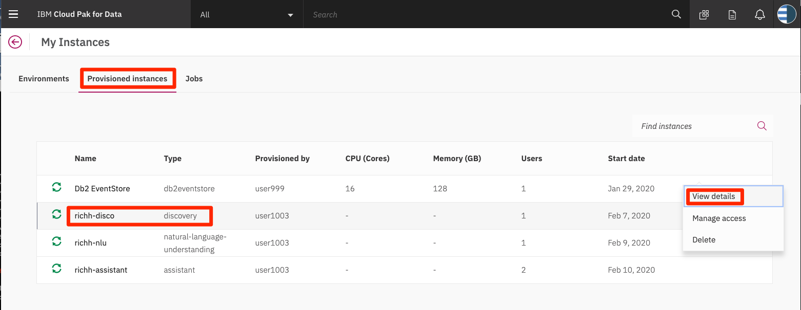

Click on `Open Watson Discovery`.

  

### Create a project and collection

Create a new project by clicking the `New Project` tile.

Give the project a unique name and select the `Document Retrieval` option, then click `Next`.

For data source, click on the `Upload data` tile and click `Next`.

Enter a unique name for your collection and click `Finish`.

> **NOTE**: on IBM Cloud Pak for Data, Discovery service queries are defaulted to be performed on all collections within a project. For this reason, it is advised that you create a new project to contain the collection we will be creating for this code pattern.

### Load the product review files

On the `Configure Collection` panel, click the `Select documents` button to select all 1000 json review files located in the `data` directory of your local repo.

Be patient as this process make take several minutes.

### Access the collection

To access the collection, make sure you are in the correct project, then click the `Manage Collections` tab in the left-side of the panel.

  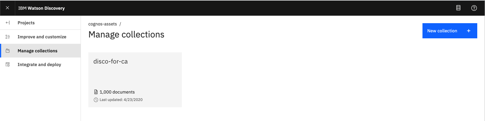

Click the collection tile to access it.

  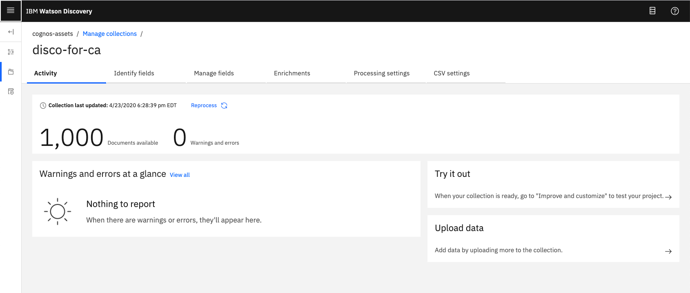

Turn on sentiments.

  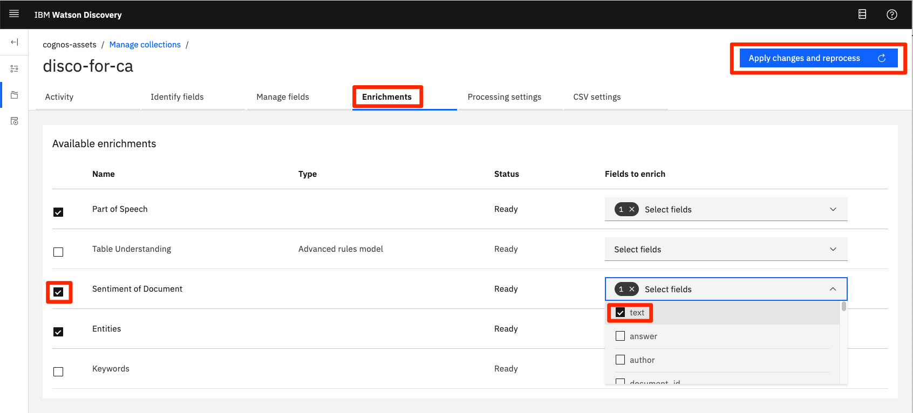

Click `Apply changes and reprocess`

Wait for all the of the documents to be reprosessed.

## 4. Add service credentials to environment file

Next, you'll need to add the Watson Discovery and Db2 Warehouse credentials to the .env file.

### 1. From the home directory of your cloned local repo, create a .env file by copying it from the sample version.

```bash
cp env.sample .env
```

### 2. Collect IBM Cloud Pak for Data credentials

* Create a user to use for authentication. From the IBM Cloud Pak for Data main navigation menu (☰), select `Administer > Manage users` and then `+ New user`.

* From the main navigation menu (☰), select `My instances`.

* On the `Provisioned instances` tab, find your service instance, and then hover over the last column to find and click the ellipses icon. Choose `View details`.

* Copy the `URL` to use as the `{SERVICE_NAME}_URL` when you configure credentials.

* Use the `Menu` and select `Users` and `+ Add user` to grant your user access to this service instance. This is the user name (and password) you will enter into your `.env` file.

### 3. Collect Watson Discovery project ID

* From your Watson Discovery service instance, click on your project.

* From the main navigation menu (☰), select `Integrate and deploy`, and then click on the `View API Information` tab.

  

* Copy the `Project ID` to enter into your `.env` file.

### 4. Edit the `.env` file with the necessary credentials and settings

#### `env.sample:`

```bash
# Copy this file to .env and replace the credentials with
# your own before starting the app.

# Watson Discovery
DISCOVERY_AUTH_TYPE=cp4d
DISCOVERY_AUTH_URL=https://my-cpd-cluster.ibmcodetest.us
DISCOVERY_USERNAME=my-username
DISCOVERY_PASSWORD=my-password
DISCOVERY_URL=https://my-cpd-cluster.ibmcodetest.us/assistant/assistant/instances/1576274722862/api
# # If you use a self-signed certificate, you need to disable SSL verification.
# # This is not secure and not recommended.
#DISCOVERY_AUTH_DISABLE_SSL=true
#DISCOVERY_DISABLE_SSL=true
DISCOVERY_PROJECT_ID=<add_project_id>
```

## 5. Run scripts to generate data

The provided scripts can be used to generate sample data for a facticious company, Named "Acme Coffee". The company offers 5 types of coffee, which is sold in grocery stores.

The scripts build the following data, which will be output to local .csv files:

* Reviews - this contains all of the reviews for each of the products. Includes rating and sentiment score.
* Products - this is information about each of our products. Includes product_id, name, and unit price.
* Keywords - this contains keywords generated from product reviews.

To run the script you will need to install [Node.js](https://nodejs.org/), an open-source JavaScript run-time environment for executing server-side JavaScript code.

```bash
npm install
cd ca-assets/lib
node generate-disco-data
```

### Additional scripting information

Outside of the scripts used to build the product and data listed above, there are additonal scripts which were used to generate product review data. The end result of the scripts is the generation of 1000 food review json files that can be loaded into Watson Discovery (see [Step #3](#3-configure-watson-discovery)). Since we have included the 1000 json files in this repo, there is no need to run the scripts again, but it is worth discussing how they work.

#### lib/find-products-with-most-reviews.js

1. Download Amazon food review data from [Kaggle](https://www.kaggle.com/snap/amazon-fine-food-reviews).
1. Save as local file `data/Reviews-full.csv`.
1. Process all reviews and log the number of reviews per product, along with how useful each review is based on `helpfullness factor`.
1. Print out the list of products in order of useful reviews.

#### lib/generate-disco-input-files.js

1. Use the top 5 reviews determined by `find-products-with-most-reviews`.
1. Cut and paste the product ID of the products associated with these reviews.
1. Add a more user-readable product ID for each.
1. Process all reviews in `data/Reviews-full.csv`, and only process the top 200 useful reviews for the products we have identified.
1. Create a json file for each review and store it in the `data/food_reviews` directory.

> **Note**: The actual review dates were spread out from 2008-20017. In order to make the data more relevant to our needs, we modified all dates to be in 2019.

## 6. Run Cognos Analytics to visualize data

### 1. Upload files into Cognos Analytics

From the main dashboard, select the `+` icon in the lower left corner. Select `Upload files`.

From the file selection dialog, select the `csv` files created by the scripts:

* `data/out-products.csv`
* `data/out-reviews.csv`
* `data/out-keywords.csv`

### 2. Create a new Data Module

From the main dashboard, select the `+` icon in the lower left corner. Select `Data module`.

From the source selection panel, select all 3 files and click `OK`.

  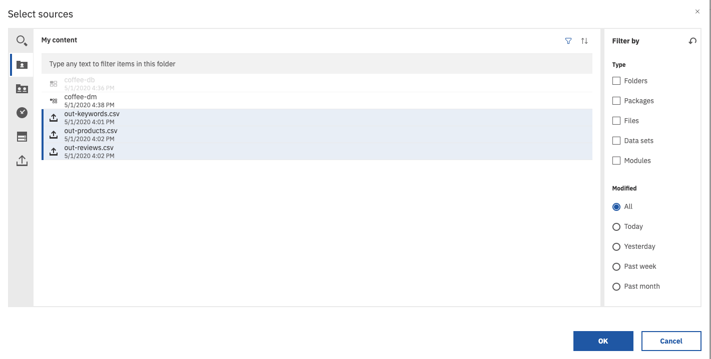

The `Data module`panel will be displayed, with the 3 files listed in the left-hand list of source files.

Select the `Relationships` tab from the content panel to view the files in the graphic editor. At this point, no relationships will exist.

  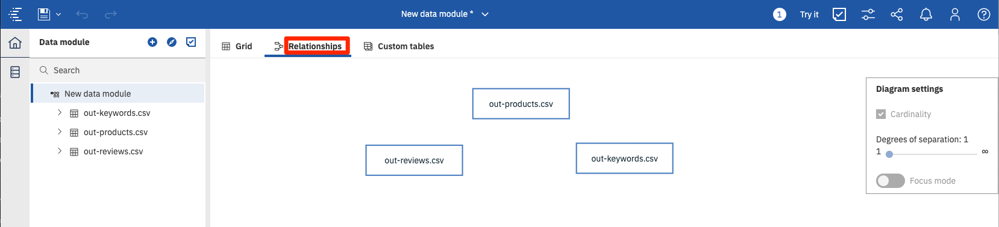

To create a relationship, right click on the `out-products.csv` file to bring up the context menu. Select `Relationship...`.

  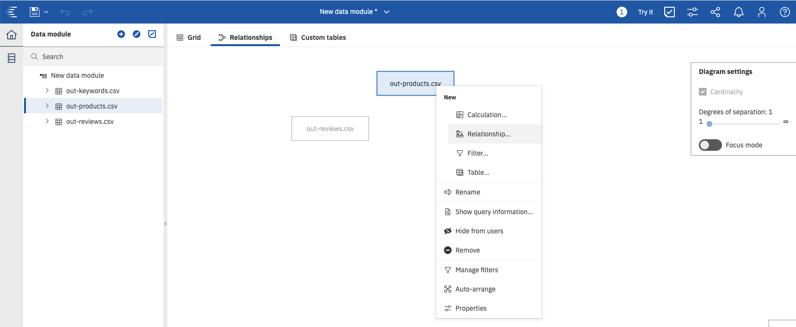

From the `Relationship` panel, select `out-reviews.csv` in the `Table 2` drop-down list. Then select `ProductId` for both tables to connect them. Then select the `Match selected columns` button to view the relationship. Click `OK` to save.

  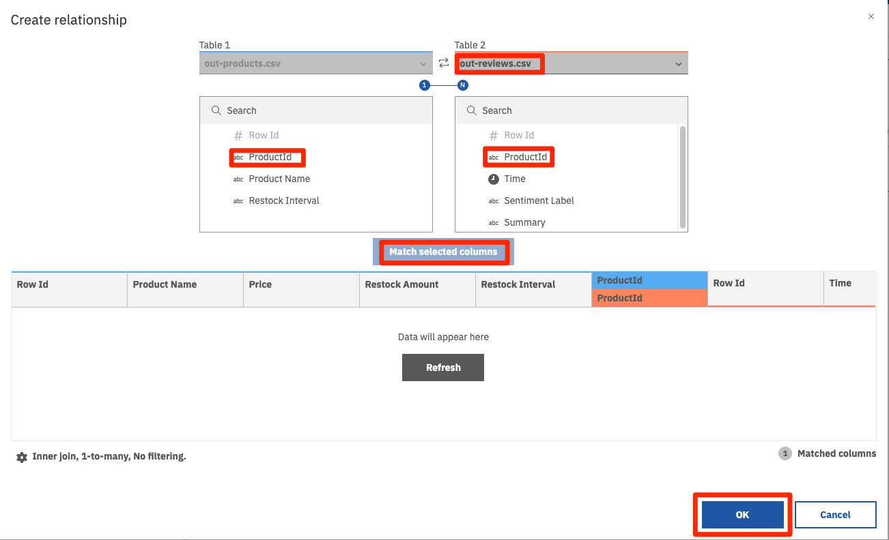

Repeat the process linking the `out-products.csv` file with `out-keywords.csv`. The end result should result in the following:

  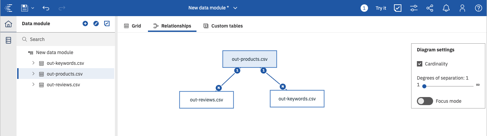

Click the `Save` icon in the top menu to save off the `Data module`.

### 3. Create a Dashboard

From the main dashboard, select the `+` icon in the lower left corner. Select `Dashboard`. Accept the default template and click `OK`.

Click `Select a source` to bring up the selction dialog. Select the `Data module` you just created, and click `OK`.

  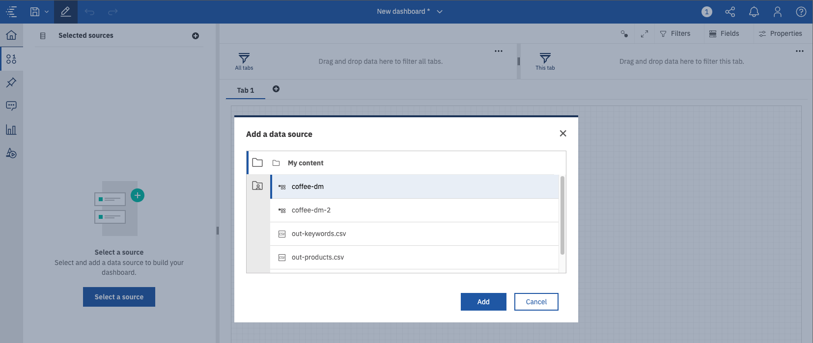

Now you should see a blank canvas to create your dashboard. The data files and field names will be displayed in the left-side menu.

  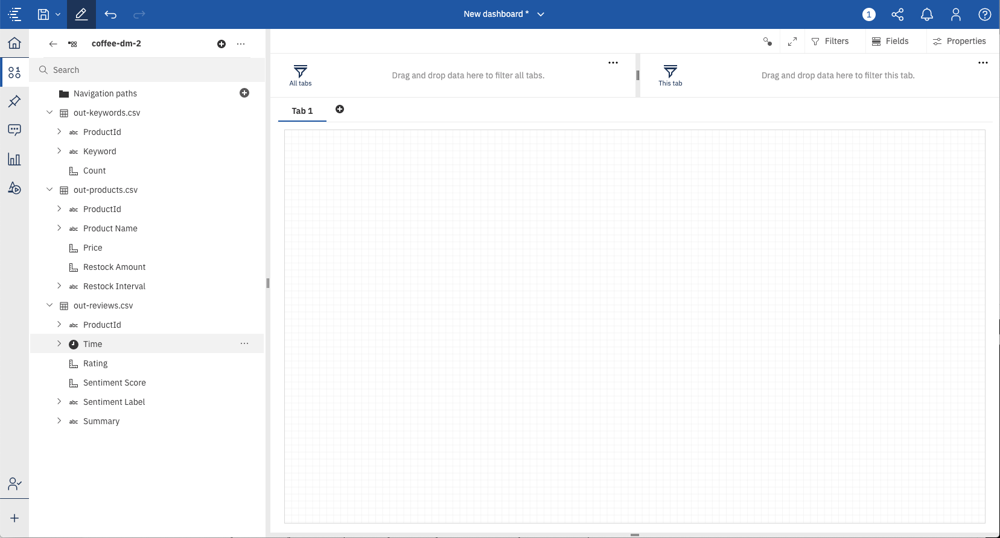

To create your dashboard, you will need to become knowledgeable with the numerous tools available from icons and pop-up menus.

  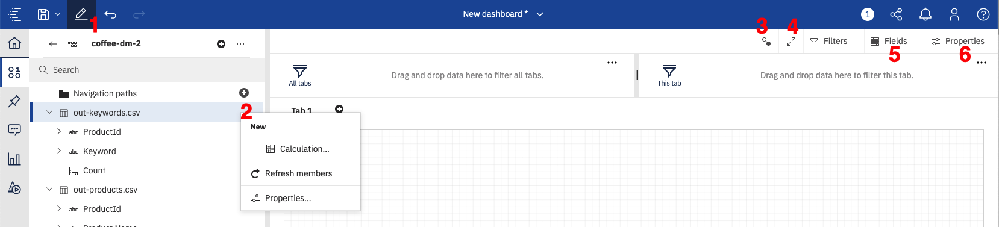

From the image above:

* 1 - toggles you between edit and preview mode.
* 2 - an example of one of many drop-down menus associated with data objects.
* 3 - displays the relationship between all of the visual objects on your dashboard. Objects with the same number are related.
* 4 - toggles full-screen mode on and off.
* 5 - displays the fields associated with the selected visual object.
* 6 - properties associated with the selected visual object.

The types of visualizations available include the following:

  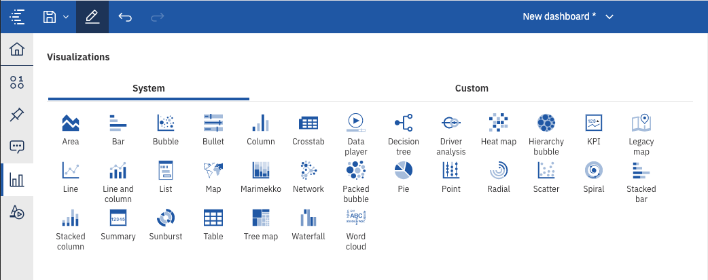

### 4. Add Visualizations to the Dashboard
