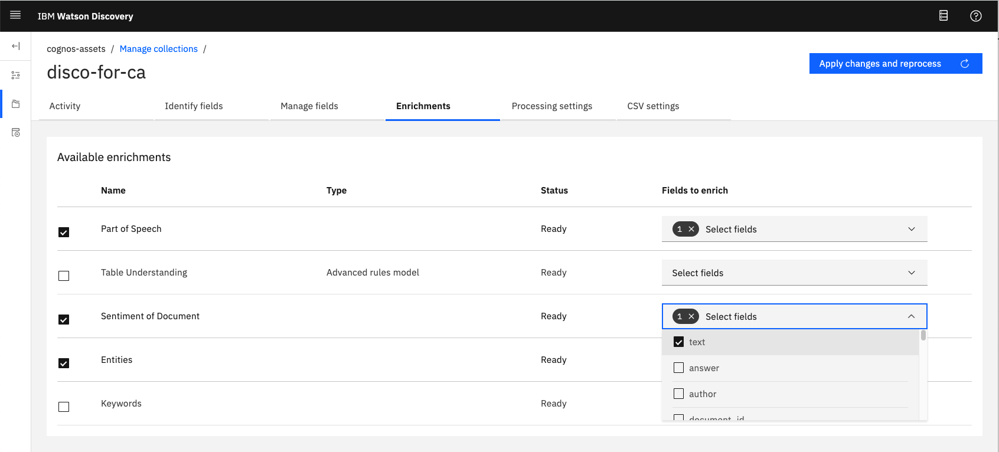
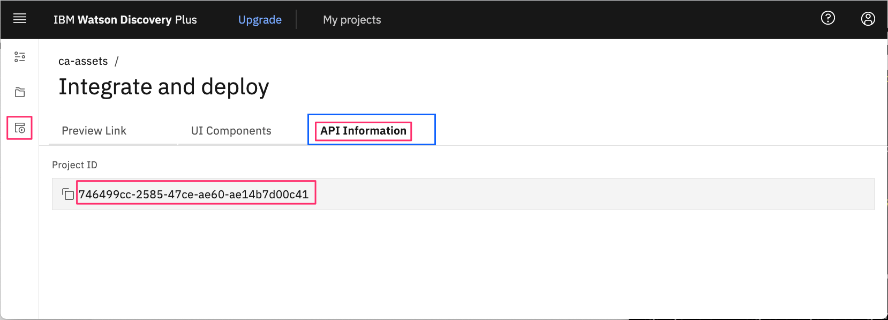
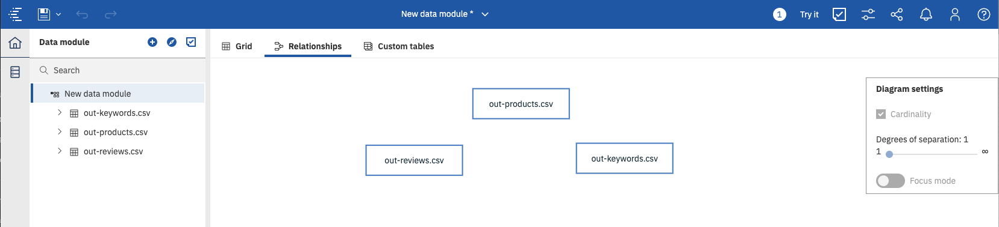
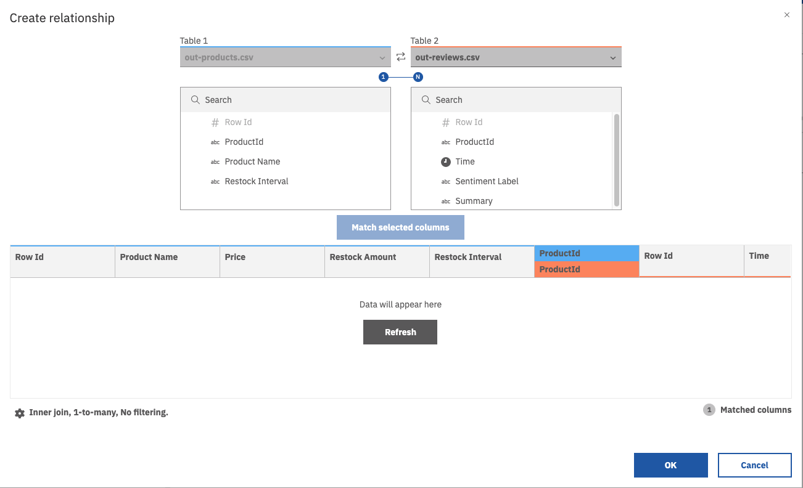

# Visualize unstructured data from Watson Discovery in the Cognos Analytics Dashboard

In this section, we will walk you through the process of loading unstructured data from Watson Discovery into Cognos Analytics, where data can be prepared and visualized using data modeling and dashboards.


## Flow

1. Product Review data is loaded into Watson Discovery for enrichment. Results include sentiment analysis and keyword discovery.
2. User runs Cognos Analytics.
3. Data files are loaded directly into Cognos Analytics.

## Steps

1. [Clone the repo](#1-clone-the-repo)
1. [Create your services on IBM Cloud Pak for Data](#2-create-your-services-on-ibm-cloud-pak-for-data)
1. [Configure Watson Discovery](#3-configure-watson-discovery)
1. [Add service credentials to environment file](#4-add-service-credentials-to-environment-file)
1. [Run scripts to generate data](#5-run-scripts-to-generate-data)
1. [Build a Data Module in Cognos Analytics](#6-build-a-data-module-in-cognos-analytics)
1. [Create a Cognos Analytics dashboard](#7-create-a-cognos-analytics-dashboard)
1. [Add visualizations to the Dashboard](#8-add-visualizations-to-the-dashboard)
1. [Update Data Module](#9-update-data-module)

## 1. Clone the repo

```bash
git clone https://github.com/IBM/cognos-analytics-using-unstructured-data
```

## 2. Create your services on IBM Cloud Pak for Data

Create the following services:

* **Watson Discovery**
* **Cognos Analytics** - click [here](https://www.ibm.com/account/reg/ca-en/signup?formid=urx-34710) to register for a free trial version

Use the following instructions for each of the services.

### Install and provision service instances

The services are not available by default. An administrator must install them on the IBM Cloud Pak for Data platform, and you must be given access to the service. To determine whether the service is installed, Click the <b>Services</b> icon () and check whether the service is enabled.

## 3. Configure Watson Discovery

### Launch Discovery

Find the Discovery service in your list of `Provisioned Instances` in your IBM Cloud Pak for Data Dashboard.

Click on `View Details` from the options menu associated with your Discovery service.

  

Click on `Open Watson Discovery`.

  

### Create a project and collection

Create a new project by clicking the `New Project` tile.

Give the project a unique name and select the `Document Retrieval` option, then click `Next`.

For data source, click on the `Upload data` tile and click `Next`.

Enter a unique name for your collection and click `Finish`.

> **NOTE**: on IBM Cloud Pak for Data, Discovery service queries are defaulted to be performed on all collections within a project. For this reason, it is advised that you create a new project to contain the collection we will be creating for this code pattern.

### Load the product review files

On the `Configure Collection` panel, click the `Select documents` button to select all 1000 json review files located in the `data` directory of your local repo.

Be patient as this process make take several minutes.

### Access the collection

To access the collection, make sure you are in the correct project, then click the `Manage Collections` tab in the left-side of the panel.

  

Click the collection tile to access it.

  

By default, `sentiments` are not turned on. To turn them on, click on the `Enrichments` tab, click the checkbox for `Sentiment of Document`, and then select `text` as the field to enrich.

  

Click `Apply changes and reprocess` to reprocess all of the reviews. This make take several minutes.

## 4. Add service credentials to environment file

Next, you'll need to add the Watson Discovery credentials to the .env file.

* From the home directory of your cloned local repo, create a .env file by copying it from the sample version

  ```bash
  cp env.sample .env
  ```

* Collect IBM Cloud Pak for Data credentials

  * Create a user to use for authentication. From the IBM Cloud Pak for Data main navigation menu (☰), select `Administer > Manage users` and then `+ New user`.

  * From the main navigation menu (☰), select `My instances`.

  * On the `Provisioned instances` tab, find your service instance, and then hover over the last column to find and click the ellipses icon. Choose `View details`.

  * Copy the `URL` to use as the `{SERVICE_NAME}_URL` when you configure credentials.

  * Use the `Menu` and select `Users` and `+ Add user` to grant your user access to this service instance. This is the user name (and password) you will enter into your `.env` file.

* Collect Watson Discovery project ID

  * From your Watson Discovery service instance, click on your project.

  * From the main navigation menu (☰), select `Integrate and deploy`, and then click on the `View API Information` tab.

    

  * Copy the `Project ID` to enter into your `.env` file.

* Edit the `.env` file with the necessary credentials and settings

  #### `env.sample:`

  ```bash
  # Copy this file to .env and replace the credentials with
  # your own before starting the app.

  # Watson Discovery
  DISCOVERY_AUTH_TYPE=cp4d
  DISCOVERY_AUTH_URL=https://my-cpd-cluster.ibmcodetest.us
  DISCOVERY_USERNAME=my-username
  DISCOVERY_PASSWORD=my-password
  DISCOVERY_URL=https://my-cpd-cluster.ibmcodetest.us/assistant/assistant/instances/1576274722862/api
  # # If you use a self-signed certificate, you need to disable SSL verification.
  # # This is not secure and not recommended.
  #DISCOVERY_AUTH_DISABLE_SSL=true
  #DISCOVERY_DISABLE_SSL=true
  DISCOVERY_PROJECT_ID=<add_project_id>
  ```

## 5. Run scripts to generate data

The provided scripts can be used to generate sample data for a facticious company, Named "Acme Coffee". The company offers 5 types of coffee, which is sold in grocery stores.

The scripts build the following data, which will be output to local .csv files:

* Reviews - this contains all of the reviews for each of the products. Includes rating and sentiment score.
* Products - this is information about each of our products. Includes product_id, name, and unit price.
* Keywords - this contains keywords generated from product reviews.

To run the script you will need to install [Node.js](https://nodejs.org/), an open-source JavaScript run-time environment for executing server-side JavaScript code.

```bash
npm install
cd ca-assets/lib/csv
node generate-product-data.js
```

### Additional scripting information

Outside of the scripts used to build the product and data listed above, there are additonal scripts which were used to generate product review data. The end result of the scripts is the generation of 1000 food review json files that can be loaded into Watson Discovery (see [Step #3](#3-configure-watson-discovery)). Since we have included the 1000 json files in this repo, there is no need to run the scripts again, but it is worth discussing how they work.

#### lib/common/find-products-with-most-reviews.js

1. Download Amazon food review data from [Kaggle](https://www.kaggle.com/snap/amazon-fine-food-reviews).
1. Save as local file `data/Reviews-full.csv`.
1. Process all reviews and log the number of reviews per product, along with how useful each review is based on `helpfullness factor`.
1. Print out the list of products in order of useful reviews.

#### lib/common/generate-disco-input-files.js

1. Use the top 5 reviews determined by `find-products-with-most-reviews`.
1. Cut and paste the product ID of the products associated with these reviews.
1. Add a more user-readable product ID for each.
1. Process all reviews in `data/Reviews-full.csv`, and only process the top 200 useful reviews for the products we have identified.
1. Create a json file for each review and store it in the `data/food_reviews` directory.

> **Note**: The actual review dates were spread out from 2008-20017. In order to make the data more relevant to our needs, we modified all dates to be in 2019.

## 6. Build a Data Module in Cognos Analytics

In Cognos Analytics, a `Data Module` serves as a data repository. It can be used to import external data from files on premise, data sources and cloud data sources. Multiple data sources can be shaped, blended, cleansed and joined  together to create a custom, resusable and sharable data module for use in dashboards and reports.

### Upload files into Cognos Analytics

From the Cognos Analytics main dashboard, select the `+` icon in the lower left corner. Select `Upload files`.

From the file selection dialog, select the `csv` files created in the previous script:

* `data/out-products.csv`
* `data/out-reviews.csv`
* `data/out-keywords.csv`

### Create a new Data Module

From the main dashboard, select the `+` icon in the lower left corner. Select `Data module`.

From the source selection panel, select all 3 files and click `OK`.

  

The `Data module`panel will be displayed, with the 3 files listed in the left-hand resource list.

Select the `Relationships` tab from the content panel to view the files in the graphic editor. At this point, no relationships will exist.

  

To create a relationship, right click on the `out-products.csv` file to bring up the context menu. Select `Relationship...`.

  

From the `Relationship` panel, select `out-reviews.csv` in the `Table 2` drop-down list. Then select `ProductId` for both tables to connect them. Then select the `Match selected columns` button to view the relationship. Click `OK` to save.

  

Repeat the process linking the `out-products.csv` file with `out-keywords.csv`. The end result should result in the following:

  

Click the `Save` icon in the top menu to save off the `Data module`.

## 7. Create a Cognos Analytics dashboard

In Cognos Analytics, a `Dashboard` provides users a way to communicate insights and analysis of their data. A dashboard view contains visualizations such as graphs, charts, plots, table, maps, or any other visual representation of data.

### Create a Dashboard

From the Cognos Analytics main dashboard, select the `+` icon in the lower left corner. Select `Dashboard`. Accept the default template and click `OK`.

Click `Select a source` to bring up the selction dialog. Select the `Data module` you just created in the previous step, and click `OK`.

  

Now you should see a blank canvas to create your dashboard. The data files and field names will be displayed in the left-side resource list.

  

To create your dashboard, you will need to become knowledgeable with the numerous tools available from icons and pop-up menus.

  

From the image above:

* 1 - toggles you between edit and preview mode.
* 2 - an example of one of many drop-down menus associated with data objects.
* 3 - displays the relationship between all of the visual objects on your dashboard. Objects with the same number are related.
* 4 - toggles full-screen mode on and off.
* 5 - displays the fields associated with the selected visual object.
* 6 - properties associated with the selected visual object.

The types of visualizations available include the following:

  

## 8. Add visualizations to the Dashboard

### Product list box

Our first visualization will be a list box containing all of our products. It will also serve as a filter - if a product is selected, all of the other visualizations on the dashboard will change its focus to that product.

Select `out-products.csv -> Product Name` in the resource list and drag it onto the canvas.

  

The toolbar at the top of the window is active for the currently selected visualization. For convenience, you can click on `Undock toolbar` to have the toolbar snap next to the selected visualization.

  .

Click on the anchor icon to bring up the toolbar for the visualization. Then click on the `Change visualization` tool. In this particular case, the default visualization choosen for the data type is a `table`. We need to change this to a `list`.

  

From the pop-up menu, click `All visualiztions` to open up the list of available visualizations. Select `list`.

  

This will transform out dashboard object from a `table` to a `list`.

From the visualization toolbar, click on the `Edit the title` icon, and set the title to `Products`.

  

Use the box sizing tools to position the box in the upper left-hand corner of the dashboard.

Use the `Expand/Collapse` button in the upper right-hand corner of your visualization to view in expanded or collapse the view in your dashboard canvas.

  

### Current product ratings

Next we want to show the current ratings for each of our products.

Select `out-reviews.csv -> Rating` and `out-products.csv -> Product Name` from the resource list and drag them onto the canvas.

In this case, we will keep the default visualization, which is a `Column` chart.

Change the title to `Current Products Ratings`

With the `Column` visualization object selected, click `Properties` from the top menu. Click on the `Visualizations` tab, and then click `Axis` to display the available options.

Change `Item axis title` to `Products`, and `Value axis title` to `Ratings`.

  

You can change the colors used for the bars by selecting `Properties`, `Color` and `Element color`.

  

### Current product sentiment

Similar to the `Product Ratings` chart, we want to also show product sentiment. The sentiment score is calculated by Watson Discovery based on the text in the product review.

Select `out-reviews.csv -> Sentiment Score` and `out-products.csv -> Product Name` from the resource list and drag them onto the canvas.

Using the same methods described for `Product Ratings`, change the title, axis labels, and color.

> **Note**: At any time, you can click on the `Edit or preview` button in the main menu bar to toggle between edit and preview mode. Click on `Previe` mode to get a better look at our current dashboard.
>
> 
>
> When toggling back to `Edit` mode, you may have to click the `Data` icon (`0111`) to display the resource list. 

### Keyword Word Cloud

For our next visualization, we want to show a `word cloud` of all the keywords detected in the product reviews by Watson Discovery. The keywords listed in the word cloud should be size appropriately to the number of times they are mentioned.

Select `out-keywords.csv -> Keyword` and `out-products.csv -> Product Name` from the resource list and drag them onto the canvas.

Change the visualization type to `Word cloud`.

With the `Word cloud` visualization object selected, click `Fields` from the top menu. To change the source field associated with the color of the keywords, drag the `out-products.csv -> Product Name` from the resource list onto the `Color` label in the field list. This will ensure that the keywords will be displayed in the same color as the product shown in the legend.

  

In the same fashion, drag `out-keywords.csv -> Count` from the resouce list onto the `Size` label in the field list. This will make the size of the keyword dependent on the number of times it is mentioned in a review (count).

  

Click on the `more` button to see more options available from the `Size` field. Select `Filter`, and set the values from 3 to 5. This will ensure that only the most mentioned keywords will show up in the word cloud.

  

For better readibility, let's make all the keywords horizontal.

With the `Word cloud` visualization object selected, click `Properties` from the top menu. Click on the `Visualizations` tab, and then click `Chart` to display the available options. Click on `Word orientation` and change the value to `Horizontal`.

  

### Product ratings over time

Next we will create a line graph that shows how the product ratings have changed over time.

Select `out-ratings.csv -> Ratings`, `out-ratings.csv -> Time` and `out-products.csv -> Product Name` from the resource list and drag them onto the canvas. We will keep the default visualization, which is a `Line and Column` graph.

As you will initially see, there are way too many graph lines. This is because it is graphing every time value, which is daily. We are only interested in monthly values, so we need to create a "calculation" to get this value.

Right-click on the `out-reviews.csv` file in the resource list, and select `Calculation`.

  

From the calculation panel, name the calculation `time_to_month`. For the expression, enter `_month()`, then drag the `Time` field inside the brackets. `_month` is a built-in function you can use to retrieve month from a date string.

Hit the `eye` icon to run the function and view the output. Click `OK` to save the calculation.

  

Our `time_to_month` calculation should now appear under the `out-reviews.csv` resource list item.

With the `Line and column` graph visualization object selected, click `Fields` from the top menu. Then drag the `time_to_month` calculation from the resource list and drop it onto the `x-axis` label in the field list. The `y-axis` field should remain `Rating`.

Using the `Properties` options, change the axis labels to `Months` and `Ratings`.

Change the title of our visualization object to `Product Ratings over time`.

Use the box sizing tools to position the box in the upper right-hand corner of the dashboard. Our dashboard top row should now look like this:

  

### Product reviews (positive and negative)

Out final visualizations will be to display actual reviews of the products. We will show both the best and the worst reviews for each product.

To start, we need to create a calculation that spans multiple files. To do this, right-click on the top-most item in our resource list, which is the `Data module`. Then select `Create calculation`.

  .

From the calculation panel, name the calculation `product_reviews`. For the expression, drag the `Product Name` field into the expression box, and then do the same with the `Summary` field. Concatenate the 2 fields inserting a `:` between them. Your expression should read:

```bash
out_products_csv.Product_Name || ': ' ||  out_reviews_csv.Summary`
```

Hit the `eye` icon to run the function and view the output. Click `OK` to save the calculation.

  .

Once the calculation is created, drag the `product_reviews` calculation onto the canvas.

With the visualization selected, click `Fields` from the top menu.

Select `out-reviews.csv -> Rating` from the resource list and drop it onto the`Local filters` label in the field list. Set the filter min and max values to `4` and `5`, which means only the best reviews with be shown.

Repeat this step, but instead use the `out-reviews.csv -> Sentiment Score` resource. In this case, set the filter min and max values to `0.8` to `.99`. Again, this will ensure only the list will only show those reviews with the highest sentiment scores, as defined by Watson Discovery.

  .

From the `Fields` menu, in the `product_reviews` object listed under `Columns`, select the  "..." menu, and select the option `Top or bottom`.

Change `Number of results` to `5`, select `Top count`, and set filter to `Sentiment Score`.

  .

Change the title of the visualization to `Positive Reviews`.

Now repeat the steps above to create "Negative Reviews". The only change should be in following:

* `Ratings` from `1` to `2`
* `Sentiment Score` from `- 0.99` to `0`
* `Columns` optioon should be set to `Bottom count`
* Set title to `Negative Reviews`

### Complete and save

Congratulations! You have completed your first Cognos Analytics dashboard. The layout and values should look similar to this:

  

Click the `Save` icon in the top menu to save your dashboard.

## 9. Update Data Module

What do you do if you want to change the underlying data that you used in your dashboard?

The good news is that if you do modify the underlying data, your dashboard will automatically update and reflect the changes.

### Upload new data files

In our example, we are using multiple `csv` files. If any of them have changed, you need to upload the file again.

From the Cognos Analytics main dashboard, select the `+` icon in the lower left corner. Select `Data module`.

From the source selection panel, select the file(s) you want to update and click `OK`.

A confirmation dialog will be displayed asking if you want to `Replace` or `Append` the data. Pick the option most appropriate to handle your changes to the data file.

The next step is to refresh your data module with the new verson of the file(s).

If you currently in the dashboard view, select your data module in the resource list and click the back arrow button.

  

Then right-click on your data module listed in the resource list, and select the option `Relink`.

  

You will then need to confirm which data module you want to replace. Select the data module you have been using with the current dashboard.

  

This action will cause your dashboard to be refreshed with the new version of the data.

## Next steps

In the next section of this code pattern, we will add more business-related data for our coffee products, store the data in Db2 Warehouse tables, and create more complex dashboard visualizations.
